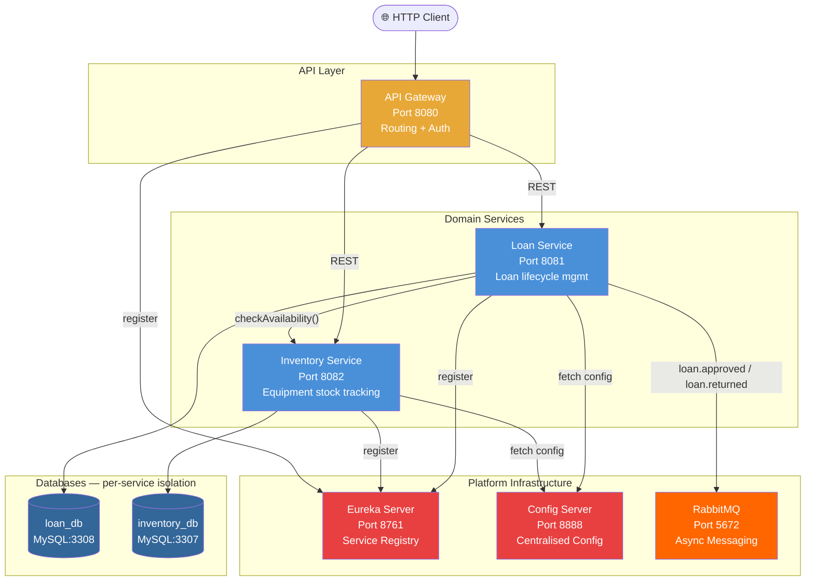
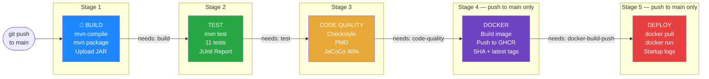

# Emergency Equipment Lending Platform — CI/CD


A microservices platform for managing emergency equipment lending. This repository demonstrates a complete **Continuous Integration / Continuous Deployment (CI/CD)** pipeline, taking the **Loan Service** microservice from a developer's code commit all the way to a running Docker container — fully automated, with no manual steps.

---

## Table of Contents
1. [Architecture](#architecture)
2. [CI/CD Pipeline](#cicd-pipeline)
3. [Technology Stack](#technology-stack)
4. [Running Tests Locally](#running-tests-locally)
5. [Local Development (Maven)](#local-development-maven)
6. [Full Platform (Docker Compose)](#full-platform-docker-compose)
7. [Environment Variables](#environment-variables)
8. [Repository Structure](#repository-structure)

---

## Architecture

The platform is built on a **microservices architecture** using Spring Boot and Spring Cloud. Each service is independently deployable and communicates either via REST (synchronous) or RabbitMQ (asynchronous events).



### Microservices

| Service | Port | Responsibility |
|---|---|---|
| **API Gateway** | 8080 | Single entry point; routes, load-balances, and authenticates all requests |
| **Eureka Server** | 8761 | Service registry; services register themselves and discover each other |
| **Config Server** | 8888 | Centralised configuration for all services from `config-repo/` |
| **Loan Service** | 8081 | Core domain service — manages loan requests, approvals, and returns |
| **Inventory Service** | 8082 | Tracks emergency equipment stock and availability |

---

## CI/CD Pipeline

The pipeline is defined in **`.github/workflows/ci-cd.yml`** and is triggered automatically on every `push` or `pull_request` to the `main` branch. All five stages are **sequential** — a failure in any stage immediately stops all downstream stages.



>  **Failure handling:** If any stage fails, all downstream stages are automatically skipped. Bad code can never reach Docker or Deployment.

### Stage 1 - Build
- **Tool:** Apache Maven 3.9.x
- **Command:** `mvn -B clean compile && mvn -B package -DskipTests`
- **Output:** `loan-service-1.0.0-SNAPSHOT.jar` uploaded as a GitHub Actions artifact
- **Key Config:** JDK 25-ea (Eclipse Temurin), Maven dependency cache enabled

### Stage 2 - Test
- **Tool:** Maven Surefire Plugin + JUnit 5 + Mockito + AssertJ
- **Command:** `mvn -B test`
- **Output:** JUnit XML reports uploaded; interactive test report published to the workflow summary
- **Key Config:** `SPRING_PROFILES_ACTIVE=test`, `EUREKA_CLIENT_ENABLED=false` — tests run fully isolated from infrastructure

### Stage 3 - Code Quality
Three quality gates enforced in sequence. Any failure blocks Docker:

| Gate | Tool | Enforced Rule |
|---|---|---|
| Style | Checkstyle | Google/Sun coding standards — naming, indentation, Javadoc |
| Bug Analysis | PMD | Detects empty catch blocks, unused code, complexity violations |
| Coverage | JaCoCo 0.8.13 | **Hard minimum of 40% line coverage** — build fails if not met |

- **Commands:** `mvn -B checkstyle:check`, `mvn -B pmd:check`, `mvn -B verify`
- **Output:** Full HTML JaCoCo coverage report uploaded as an artifact

### Stage 4 - Docker Build and Push
- **Tool:** `docker/build-push-action@v6`, multi-stage Dockerfile
- **Registry:** GitHub Container Registry — `ghcr.io/vinayreddy072/loan-service`
- **Tags:** `latest` (main branch) + short Git SHA for traceability
- **Only runs on:** `push` to `main` (not on pull requests)

### Stage 5 - Deploy
- **Tool:** Bash scripted `docker run` automation
- **Steps:** Pull image → remove existing container → start new container → wait 10s → print startup logs
- **Purpose:** Automated deployment demonstrating a running container — zero manual intervention

---

## Technology Stack

| Category | Technology | Version |
|---|---|---|
| Language | Java | 25 (EA) |
| Framework | Spring Boot | 4.1.0 |
| Cloud | Spring Cloud | 2025.1.2 |
| Build | Apache Maven | 3.9.4 |
| Containerisation | Docker (multi-stage) | - |
| Registry | GitHub Container Registry (GHCR) | - |
| CI/CD | GitHub Actions | -|
| Testing | JUnit 5, Mockito, AssertJ | via Spring Boot BOM |
| Style Analysis | Checkstyle | Maven Plugin |
| Bug Analysis | PMD | Maven Plugin |
| Coverage | JaCoCo | 0.8.13 |
| Service Discovery | Netflix Eureka | Spring Cloud |
| Messaging | RabbitMQ | 4.1 |
| Database | MySQL | 8.4 |

---

## Running Tests Locally

```bash
mvn -B test \
  -f services/loan-service/pom.xml \
  -Dspring.profiles.active=test \
  "-Dspring.config.import=" \
  -Deureka.client.enabled=false \
  --no-transfer-progress
```

Expected: `Tests run: 11, Failures: 0, Errors: 0, Skipped: 0`

### Test Pyramid

| Level | Class | Tests | Tool |
|---|---|---|---|
| **Unit** | `LoanRequestServiceTest` | 7 | Mockito — pure logic, no Spring context |
| **Integration** | `LoanRequestRepositoryTest` | 2 | `@DataJpaTest` with H2 in-memory DB |
| **API/Slice** | `LoanRequestControllerTest` | 2 | `@WebMvcTest` — HTTP contracts and JSON |

### Generate Coverage Report

```bash
mvn -B verify \
  -f services/loan-service/pom.xml \
  -Dspring.profiles.active=test \
  "-Dspring.config.import=" \
  --no-transfer-progress

# Open report (Windows)
start services/loan-service/target/site/jacoco/index.html
```

---

## Local Development (Maven)

Start services in this order (each in a separate terminal):

```bash
# 1. Eureka Server (must be first)
cd platform/eureka-server && mvn spring-boot:run

# 2. Config Server
cd platform/config-server && mvn spring-boot:run

# 3. Domain Services
cd services/loan-service && mvn spring-boot:run
cd services/inventory-service && mvn spring-boot:run

# 4. API Gateway (after all services are up)
cd platform/api-gateway && mvn spring-boot:run
```

- API Gateway: `http://localhost:8080`
- Eureka Dashboard: `http://localhost:8761`

---

## Full Platform (Docker Compose)

```bash
cp .env.example .env          # copy and edit env vars if needed
docker compose up -d          # start all services
docker compose ps             # verify all are healthy
docker compose logs loan-service -f  # tail loan service logs
```

**Service URLs:**
- API Gateway: `http://localhost:8080`
- Eureka Dashboard: `http://localhost:8761`
- RabbitMQ Management UI: `http://localhost:15672` (guest/guest)

---

## Environment Variables

| Variable | Default | Description |
|---|---|---|
| `LOAN_DB_URL` | `jdbc:mysql://mysql-loan:3308/loan_db` | Loan DB connection URL |
| `LOAN_DB_USER` | `loan_user` | Loan DB username |
| `LOAN_DB_PASS` | `loan_pass` | Loan DB password |
| `INVENTORY_DB_URL` | `jdbc:mysql://mysql-inventory:3307/inventory_db` | Inventory DB URL |
| `RABBITMQ_HOST` | `rabbitmq` | RabbitMQ hostname |
| `MYSQL_ROOT_PASSWORD` | `rootpass` | MySQL root password |

---

## Repository Structure

```
Microservices_CI_CD/
├── .github/
│   └── workflows/
│       ├── ci-cd.yml          # Main CI/CD pipeline (Loan Service - 5 stages)
│       └── ci.yml             # Multi-service CI pipeline with Trivy security scans
├── platform/
│   ├── api-gateway/           # Spring Cloud Gateway
│   ├── config-server/         # Spring Cloud Config Server
│   └── eureka-server/         # Netflix Eureka Service Registry
├── services/
│   ├── loan-service/          # Core domain microservice (CI/CD focus)
│   │   ├── src/test/java/     # 11 automated tests (unit + integration + API)
│   │   └── Dockerfile         # Multi-stage Docker build
│   └── inventory-service/     # Equipment inventory microservice
├── k8s/                       # Kubernetes manifests
├── config-repo/               # Centralised Spring Cloud Config properties
├── docker-compose.yml         # Full platform local orchestration
├── pom.xml                    # Parent POM - JaCoCo, PMD, Checkstyle managed here
└── README.md                  
```

---

**Repository:** [https://github.com/VinayReddy072/Microservices_CI_CD](https://github.com/VinayReddy072/Microservices_CI_CD) 

**Report:** [https://github.com/VinayReddy072/Microservices_CI_CD/Report.md](https://github.com/VinayReddy072/Microservices_CI_CD/Report.md)

