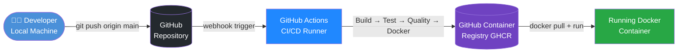
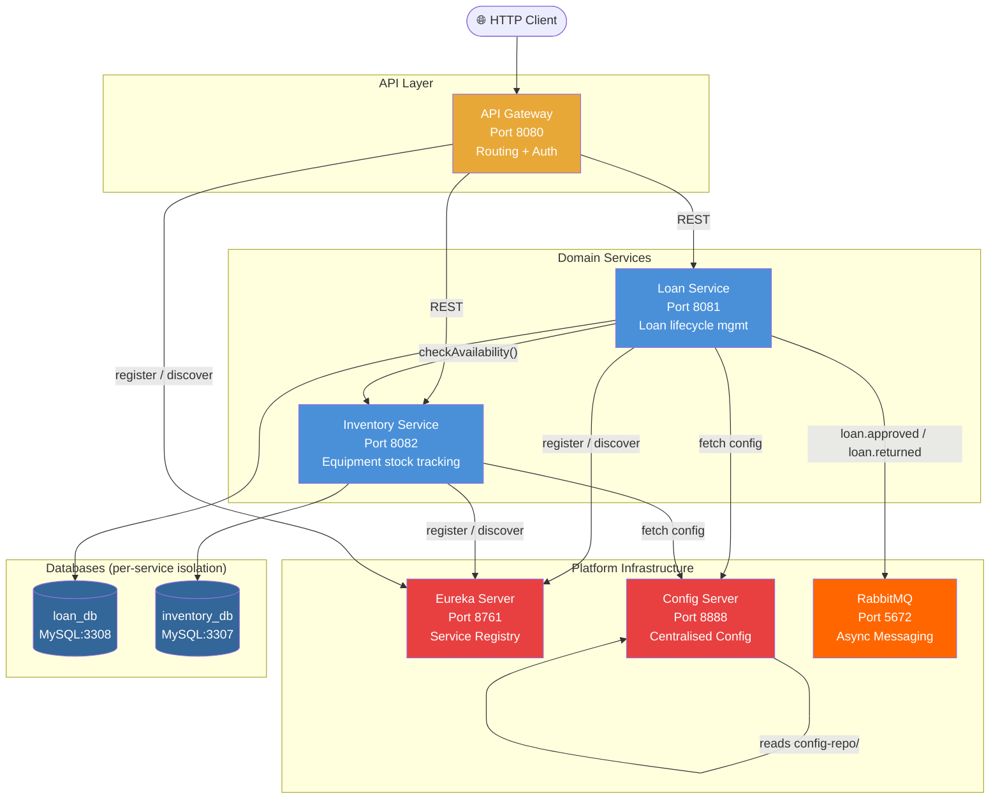
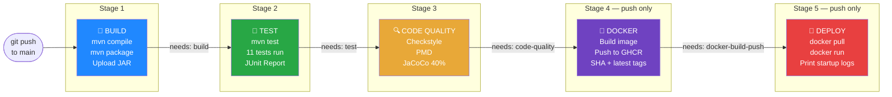
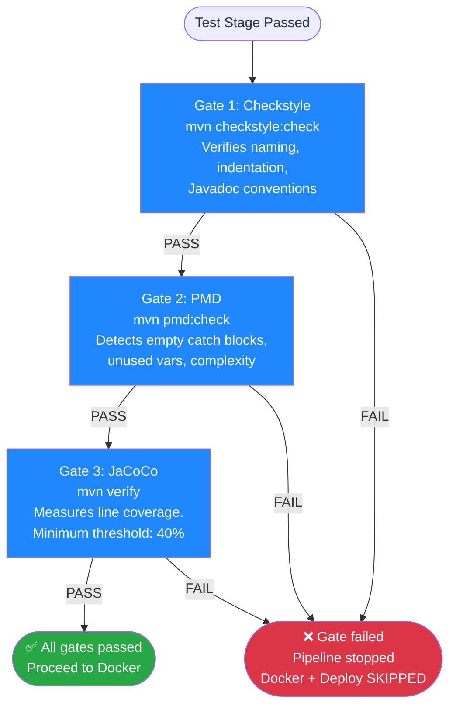
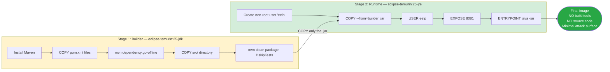
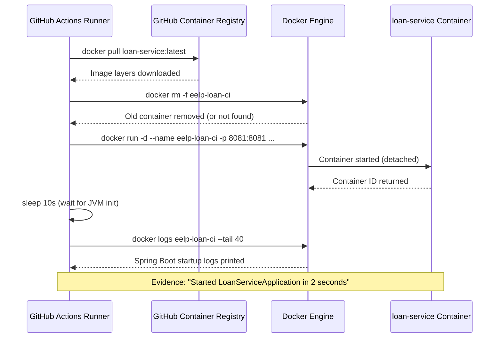

# Continuous Build and Delivery - Report
## Emergency Equipment Lending Platform: Loan Service CI/CD Pipeline

**Student:** Vinay Reddy Thalla  
**Student ID:**	A00336165  
**Module:** Continuous Build and Delivery 2025/26  
**Repository:** https://github.com/VinayReddy072/Microservices_CI_CD

---

## 1. Introduction to CI/CD

### 1.1 Continuous Integration vs. Continuous Delivery

**Continuous Integration (CI)** is the practice of frequently merging developer code changes into a shared mainline repository,  typically multiple times per day,  where each merge triggers an automated sequence of build and test steps (Fowler, 2006). The primary goal of CI is to detect integration defects early, before they compound into larger, harder-to-diagnose failures. CI fundamentally changes the team's relationship with broken code: rather than discovering incompatibilities days or weeks after they were introduced, the team knows within minutes.

**Continuous Delivery (CD)** extends CI by ensuring that the software is always in a deployable state (Humble and Farley, 2010). In a CD pipeline, every commit that passes the automated build, test, and quality gates is automatically packaged into a deployable artifact — typically a Docker image — and can be released to production at any time with a single command, or automatically. This is distinct from **Continuous Deployment**, where every passing build is deployed to production automatically without human approval.

The key distinction is this: CI is about verifying code correctness at high frequency; CD is about ensuring business value can be delivered to users reliably and rapidly.

### 1.2 State-of-the-Art Practices and Tools

The modern CI/CD landscape has evolved significantly since the early adoption of tools like Jenkins (originally Hudson, 2004). Contemporary best practices include:

- **Pipeline as Code:** Defining CI/CD pipelines in version-controlled configuration files rather than through GUI-based tools. GitHub Actions (`.github/workflows/*.yml`), GitLab CI (`.gitlab-ci.yml`), and Jenkins (`Jenkinsfile`) all exemplify this approach (Forsgren, Humble and Kim, 2018).
- **Shift-Left Testing:** Moving testing earlier in the development process, catching defects before they reach integration or production. This is operationalised through the Test Pyramid (Cohn, 2009), which prioritises fast, cheap unit tests over slow, expensive end-to-end tests.
- **Quality Gates:** Automated pass/fail enforcement criteria, minimum code coverage thresholds, zero critical static analysis violations, that prevent defective code from progressing through the pipeline (Kim et al., 2016).
- **Containerisation:** Building portable Docker images ensures environment parity: the same artifact tested in CI is deployed in production, eliminating "works on my machine" problems (Merkel, 2014).
- **Security Scanning:** Tools like Trivy and SonarQube now scan Docker images and source code for known vulnerabilities (CVEs) within the pipeline itself, implementing a DevSecOps approach (Myrbakken and Colomo-Palacios, 2017).

Leading platforms in 2025 include **GitHub Actions** (native GitHub integration, YAML-based, extensive marketplace), **GitLab CI/CD** (self-hosted or cloud, strong security scanning), **CircleCI** (cloud-native, strong parallelism), and **Tekton** (Kubernetes-native pipelines). SonarCloud and SonarQube remain the dominant tools for static code quality analysis.

### References

- Cohn, M. (2009) *Succeeding with Agile: Software Development Using Scrum*. Addison-Wesley Professional.
- Forsgren, N., Humble, J. and Kim, G. (2018) *Accelerate: The Science of Lean Software and DevOps*. IT Revolution Press.
- Fowler, M. (2006) *Continuous Integration*. [online] martinfowler.com. Available at: https://martinfowler.com/articles/continuousIntegration.html [Accessed 15 August 2026].
- Humble, J. and Farley, D. (2010) *Continuous Delivery: Reliable Software Releases through Build, Test, and Deployment Automation*. Addison-Wesley Professional.
- Kim, G. et al. (2016) *The DevOps Handbook: How to Create World-Class Agility, Reliability, and Security in Technology Organizations*. IT Revolution Press.
- Merkel, D. (2014) 'Docker: Lightweight Linux containers for consistent development and deployment', *Linux Journal*, 2014(239), p. 2.
- Myrbakken, H. and Colomo-Palacios, R. (2017) 'DevSecOps: A Multivocal Literature Review', in *Software Process Improvement and Capability Determination*. Springer, Cham, pp. 17–29.

---

## 2. User Stories

The following user stories are written from the perspective of stakeholders interacting with the **Loan Service** microservice of the Emergency Equipment Lending Platform.

### Story 1 - Submit a Loan Request

**As a** first responder at an emergency scene,  
**I want to** submit a request to borrow a specific piece of equipment by providing my name, contact, and the equipment ID,  
**So that** I can receive formal approval to use the equipment and have a traceable record of the lending.

**Acceptance Criteria:**
- A `POST /loans` request with valid `equipmentItemId`, `borrowerName`, and `borrowerContact` returns HTTP `201 Created`.
- The response body contains the generated loan ID and a status of `PENDING`.
- The system records the `requestedAt` timestamp automatically.
- A `POST /loans` request with missing required fields returns HTTP `400 Bad Request` with per-field error messages.

---

### Story 2 - Approve a Loan Request

**As a** logistics coordinator,  
**I want to** approve a pending loan request after confirming the equipment is available in the inventory,  
**So that** the borrower is formally authorised and the equipment stock is correctly reserved.

**Acceptance Criteria:**
- A `POST /loans/{id}/approve` when equipment is available (`InventoryService` reports `AVAILABLE`) transitions status to `APPROVED`.
- A `POST /loans/{id}/approve` when equipment is unavailable (e.g., `ON_LOAN`) transitions status to `REJECTED`.
- Approving a loan that is not in `PENDING` status returns HTTP `409 Conflict`.
- On approval, a `loan.approved` event is published to the RabbitMQ message broker.

---

### Story 3 - Return Equipment

**As a** logistics coordinator,  
**I want to** record the return of equipment from an approved loan,  
**So that** the equipment becomes available again in the inventory and the lending record is closed.

**Acceptance Criteria:**
- A `POST /loans/{id}/return` on an `APPROVED` loan transitions status to `RETURNED` and records the `returnedAt` timestamp.
- A `POST /loans/{id}/return` on a non-`APPROVED` loan returns HTTP `409 Conflict`.
- On return, a `loan.returned` event is published to the message broker.

---

### Story 4 - View a Specific Loan

**As a** borrower,  
**I want to** look up the details of my loan request by ID,  
**So that** I can track its current status and see the approval outcome.

**Acceptance Criteria:**
- A `GET /loans/{id}` for an existing loan returns HTTP `200 OK` with the full loan record (ID, status, borrower details, timestamps).
- A `GET /loans/{id}` for a non-existent loan returns HTTP `404 Not Found`.

---

### Story 5 - Automated Quality Gate (DevOps Stakeholder)

**As a** DevOps engineer,  
**I want to** ensure that no code change can be deployed unless it passes all three quality gates (code style, static bug analysis, and minimum 40% test coverage),  
**So that** technical debt is kept manageable and defective code is never promoted to production.

**Acceptance Criteria:**
- Any commit that triggers a Checkstyle violation causes the pipeline to fail at the Code Quality stage.
- Any commit that reduces coverage below 40% causes the pipeline to fail at the Code Quality stage.
- The Docker Build and Deploy stages are skipped when the Code Quality stage fails.
- A passing Code Quality stage produces an uploaded JaCoCo HTML coverage report as a pipeline artifact.

---

## 3. High-Level Architecture

### 3.1 Platform Overview

The Emergency Equipment Lending Platform is a **microservices-based system** built with Spring Boot 4.1.0 and Spring Cloud 2025.1.2. Each microservice owns its own database (the **Database-per-Service** pattern) and exposes a REST API. Asynchronous communication between services is handled via RabbitMQ.

**Figure 1 - CI/CD Delivery Flow (Developer to Deployed Container)**



**Figure 2 - Runtime Microservices Architecture**



### 3.2 Architecture Decisions

| Decision | Choice | Rationale |
|---|---|---|
| **API Pattern** | REST over HTTP | Industry standard for microservice APIs; well understood, tooling-rich |
| **Service Discovery** | Netflix Eureka | Spring Cloud native integration; dynamic registration eliminates hardcoded endpoints |
| **Configuration** | Spring Cloud Config Server | Centralised, environment-aware configuration — dev/test/prod profiles from one source |
| **Async Messaging** | RabbitMQ | Decouples services for events like `loan.approved` and `loan.returned` |
| **Database per Service** | MySQL (per service) | Strict isolation — Loan Service owns `loan_db`, Inventory Service owns `inventory_db` |
| **Containerisation** | Docker (multi-stage) | Reproducible builds; smaller final image (JRE only, not JDK) |

---

## 4. Test Strategy

### 4.1 Overview

The testing strategy for the Loan Service is designed around the **Test Pyramid** model (Cohn, 2009), which prescribes a large base of fast, isolated unit tests, a smaller middle layer of integration tests, and a minimal top layer of end-to-end tests. This maximises developer feedback speed: the cheapest, fastest tests run first and catch the most common failures.

All tests are automatically executed by the GitHub Actions CI/CD pipeline on every commit, meaning no code change can be deployed without passing the full test suite.

### 4.2 Test Pyramid Alignment

```
        ▲
        |
      ──┼─── LAYER 3: API / Slice Tests (2 tests) ──────────────────
        |     @WebMvcTest: HTTP contracts, status codes, JSON
        |       Fast, no real DB needed
        |
    ────┼────── LAYER 2: Integration Tests (2 tests) ───────────────
        |          @DataJpaTest: JPA entity mapping, H2 in-memory DB
        |          Tests actual persistence layer
        |
────────┼────────── LAYER 1: Unit Tests (7 tests) ──────────────────
        |        @ExtendWith(MockitoExtension): Pure Java logic
        |         No Spring context loaded — milliseconds to run

```

### 4.3 Test Levels

#### Layer 1 - Unit Tests (`LoanRequestServiceTest.java`)
**Framework:** JUnit 5 + Mockito + AssertJ  
**Scope:** Tests the `LoanRequestService` class in complete isolation. All dependencies (`LoanRequestRepository`, `InventoryAvailabilityAdapter`, `LoanEventPublisher`) are mocked using Mockito's `@Mock` annotation. No Spring application context is loaded.

| Test Method | What It Verifies |
|---|---|
| `create_shouldPersistWithPendingStatus` | A new loan request is saved with `PENDING` status and correct borrower fields |
| `approve_whenEquipmentAvailable_shouldSetApproved` | Loan transitions `PENDING → APPROVED` when inventory confirms availability |
| `approve_whenEquipmentUnavailable_shouldSetRejected` | Loan transitions `PENDING → REJECTED` when equipment is `ON_LOAN` |
| `approve_whenNotPending_shouldThrowIllegalState` | Approving a non-PENDING loan throws `IllegalStateException` |
| `returnLoan_whenApproved_shouldSetReturned` | Loan transitions `APPROVED → RETURNED` and publishes event |
| `returnLoan_whenNotApproved_shouldThrowIllegalState` | Returning a non-APPROVED loan throws `IllegalStateException` |
| `findById_whenNotFound_shouldThrowEntityNotFound` | Querying an unknown ID throws `EntityNotFoundException` |

#### Layer 2 - Integration Tests (`LoanRequestRepositoryTest.java`)
**Framework:** JUnit 5 + Spring Boot `@DataJpaTest` + H2 in-memory database  
**Scope:** Tests the `LoanRequestRepository` JPA interface against a real (though embedded) database. Verifies that entity field mappings, auto-generated IDs, default column values, and Hibernate DDL are all correctly configured. Does not start a full Spring context or load any web layer.

| Test Method | What It Verifies |
|---|---|
| `save_shouldPersistEntityWithGeneratedIdAndDefaultStatus` | Saved entity receives auto-generated ID and default PENDING status |
| `findById_shouldReturnEntityWithAllPersistedFields` | All entity fields are correctly persisted and retrievable |

#### Layer 3 - API Slice Tests (`LoanRequestControllerTest.java`)
**Framework:** JUnit 5 + Spring Boot `@WebMvcTest` + MockMvc  
**Scope:** Loads only the Spring MVC layer (controller + exception handlers). The `LoanRequestService` is replaced with a `@MockitoBean`. Tests verify HTTP contracts: correct response status codes, response body structure, and Bean Validation error handling.

| Test Method | What It Verifies |
|---|---|
| `createLoan_validRequest_returns201WithPendingStatus` | Valid `POST /loans` returns `201 Created` with correct JSON body |
| `createLoan_missingFields_returns400WithFieldErrors` | Empty `POST /loans` body returns `400 Bad Request` with per-field errors |

### 4.4 Test Infrastructure

Tests run with the `test` Spring profile activated (`SPRING_PROFILES_ACTIVE=test`), which switches from the production MySQL database to an H2 in-memory database. Eureka client registration is disabled (`EUREKA_CLIENT_ENABLED=false`), and Spring Cloud Config import is suppressed, ensuring tests run entirely offline without any external infrastructure.

---

## 5. Pipeline Description

### 5.1 Pipeline Overview

The CI/CD pipeline is defined in `.github/workflows/ci-cd.yml` and is orchestrated by **GitHub Actions**. It consists of five sequential jobs connected via the `needs:` keyword. If any job fails, GitHub Actions cancels all downstream jobs immediately.

**Trigger Conditions:**
- `push` to the `main` branch (targets `services/loan-service/**` paths)
- `pull_request` targeting the `main` branch

**Pipeline Stage Flow and Dependencies**



### 5.2 Stage-by-Stage Description

---

#### Stage 1 - Build

The Build stage checks out the repository using `actions/checkout@v4` and installs JDK 25-ea (Eclipse Temurin distribution) with Maven dependency caching enabled. It then runs `mvn -B clean compile` to verify all Java sources compile successfully, followed by `mvn -B package -DskipTests` to produce the executable JAR artifact. Tests are intentionally skipped here so that build failures are reported separately from test failures, giving the team faster diagnostic information. The produced JAR is uploaded as a GitHub Actions artifact retained for 7 days, proving the deployable artifact exists independently of the pipeline run.

**Key Configuration:**
```yaml
- name: Compile loan-service
  run: mvn -B clean compile -f services/loan-service/pom.xml --no-transfer-progress

- name: Package loan-service JAR (skip tests)
  run: mvn -B package -DskipTests -f services/loan-service/pom.xml --no-transfer-progress

- name: Upload loan-service JAR artifact
  uses: actions/upload-artifact@v4
  with:
    name: loan-service-jar
    path: services/loan-service/target/loan-service-*.jar
    retention-days: 7
```

**Output:** `loan-service-1.0.0-SNAPSHOT.jar` uploaded as a retained pipeline artifact.

---

#### Stage 2 - Test

The Test stage runs only after the Build stage succeeds (`needs: build`). It executes the full test suite using `mvn -B test` with the `test` Spring profile, which activates an in-memory H2 database and disables Eureka registration. All 11 tests — 7 unit, 2 integration, 2 API slice — are executed automatically. The `dorny/test-reporter` action publishes an interactive JUnit results page directly in the GitHub workflow summary, and raw Surefire XML reports are uploaded as artifacts retained for 14 days. This stage is the quality gate for correctness — no code can proceed to Code Quality unless all 11 tests pass.

**Key Configuration:**
```yaml
- name: Run unit and integration tests
  env:
    SPRING_PROFILES_ACTIVE: test
    SPRING_CONFIG_IMPORT: ''
    EUREKA_CLIENT_ENABLED: 'false'
  run: mvn -B test -f services/loan-service/pom.xml --no-transfer-progress

- name: Publish JUnit test report
  uses: dorny/test-reporter@v1
  if: always()
  with:
    name: Loan Service — JUnit Results
    path: services/loan-service/target/surefire-reports/*.xml
    reporter: java-junit
    fail-on-error: true
```

**Output:** `Tests run: 11, Failures: 0, Errors: 0, Skipped: 0`

---

#### Stage 3 - Code Quality

The Code Quality stage runs only after Test succeeds and enforces three automated quality gates in sequence. Each gate is a hard pass/fail criterion — any single failure causes the entire stage to fail, producing a clear exit code 1, and GitHub Actions immediately cancels the downstream Docker and Deploy stages.

**Figure 4 — Three Quality Gates in Code Quality Stage**



**Gate 1 - Checkstyle:** Validates source code against a defined set of coding style rules (naming conventions, indentation, Javadoc presence). Configured as a Maven plugin in the parent `pom.xml`. A violation causes an immediate build failure with the offending file and line number printed to the log.

**Gate 2 - PMD:** Performs static bug pattern analysis, detecting empty catch blocks, unused local variables, overly complex methods, and other common anti-patterns. Configured with a ruleset in the parent `pom.xml`.

**Gate 3 - JaCoCo Coverage:** JaCoCo instruments the bytecode during the `mvn verify` phase and measures the percentage of production code lines executed by the test suite. A hard minimum of **40% line coverage** is enforced via the `jacoco:check` goal bound to the `verify` Maven lifecycle phase. If coverage falls below this threshold, the Maven build exits with code 1 and the pipeline fails. A full HTML coverage report broken down by class, method, branch, and line is uploaded as an artifact retained for 14 days.

**Key Configuration:**
```yaml
- name: Run Checkstyle
  run: mvn -B checkstyle:check -f services/loan-service/pom.xml

- name: Run PMD
  run: mvn -B pmd:check -f services/loan-service/pom.xml

- name: Generate JaCoCo coverage and enforce 40% threshold
  env:
    SPRING_PROFILES_ACTIVE: test
    SPRING_CONFIG_IMPORT: ''
    EUREKA_CLIENT_ENABLED: 'false'
  run: mvn -B verify -f services/loan-service/pom.xml --no-transfer-progress
```

**Tool Justification:** Checkstyle and PMD were chosen because they require no external server infrastructure and integrate directly into the Maven lifecycle, keeping the pipeline fully self-contained. JaCoCo was chosen as the coverage tool because it is the de-facto standard for Java and its `check` goal allows coverage thresholds to be embedded directly in the build definition, making the quality gate automatic and reproducible.

---

#### Stage 4 - Docker Build and Push

This stage runs only after Code Quality succeeds and only on `push` events to `main` (not on pull requests). It builds a multi-stage Docker image using the official `docker/build-push-action@v6`.

The multi-stage Dockerfile is a key architectural decision illustrated below:

**Multi-Stage Docker Build Process**



**Stage 1 (Builder)** uses a full `eclipse-temurin:25-jdk` image to download Maven dependencies and compile the application. **Stage 2 (Runtime)** starts fresh from a minimal `eclipse-temurin:25-jre` image and copies only the compiled `.jar` file. This means the final production image contains no build tooling, no source code, and no Maven installation — dramatically reducing the attack surface and image size.

The built image is tagged with two labels: `latest` (the most recent main branch build) and a short 7-character Git commit SHA (e.g., `a1b2c3d`), enabling precise traceability from any running container back to its exact source commit.

**Key Configuration:**
```yaml
- name: Build and push loan-service image
  uses: docker/build-push-action@v6
  with:
    context: .
    file: services/loan-service/Dockerfile
    push: true
    tags: ${{ steps.meta.outputs.tags }}
    labels: ${{ steps.meta.outputs.labels }}
    cache-from: type=gha,scope=loan-service
    cache-to: type=gha,mode=max,scope=loan-service
```

---

#### Stage 5 - Deploy

The Deploy stage runs only after Docker Build and Push succeeds. It implements scripted deployment automation using a sequence of `docker` CLI commands. This Bash script satisfies the assignment's "scripted automation" deployment requirement and produces verifiable log evidence of a running application.

**Automated Deployment Sequence**



**Key Configuration:**
```yaml
- name: Pull loan-service image from GHCR
  run: docker pull ${{ env.IMAGE_NAME }}:latest

- name: Remove existing container (if running)
  run: docker rm -f eelp-loan-ci 2>/dev/null || true

- name: Start loan-service container
  run: |
    docker run -d \
      --name eelp-loan-ci \
      -p 8081:8081 \
      -e SPRING_PROFILES_ACTIVE=dev \
      -e SPRING_CONFIG_IMPORT="optional:configserver:" \
      -e EUREKA_CLIENT_ENABLED=false \
      ${{ env.IMAGE_NAME }}:latest

- name: Show container status and startup logs
  run: |
    sleep 10
    docker ps -f name=eelp-loan-ci
    docker logs eelp-loan-ci --tail 40 || true
```
---

## 6. Evaluation and Reflection

### 6.1 Pipeline Execution Time

Based on observed pipeline runs, the total end-to-end execution time from commit to deployed container is approximately **5 to 7 minutes**, broken down as follows:

| Stage | Approximate Duration | Primary Cost |
|---|---|---|
| Build | ~1 min | Maven dependency download (cached on subsequent runs) |
| Test | ~1 min | Spring context bootstrap for `@DataJpaTest` and `@WebMvcTest` |
| Code Quality | ~2 min | JaCoCo must re-execute all tests to instrument bytecode |
| Docker Build and Push | ~1–2 min | Base image layer pull; subsequent runs use GitHub Actions cache |
| Deploy | ~30 sec | Image pull (cached locally) + container startup |

**Maven Dependency Caching:** The pipeline uses `cache: maven` in the `actions/setup-java` step, which caches the `~/.m2` repository between runs. This reduces subsequent pipeline times by approximately 60–80 seconds on the Build and Code Quality stages.

### 6.2 Automation Level

The automation level is very high. Following a `git push origin main`, there is **zero human intervention** required across the entire journey from code to running container. The pipeline handles:
- Source code compilation
- All 11 automated tests
- Three independent code quality gates
- Docker image construction and publication
- Container deployment and health verification

The only manual step in the workflow is the initial developer action of typing `git push`. All subsequent stages are automatic, deterministic, and traceable.

### 6.3 Conscious Trade-off: Security Strictness vs. Developer Velocity

The `ci.yml` workflow includes a Trivy vulnerability scanner that scans each Docker image for known CVEs (Common Vulnerabilities and Exposures). A deliberate design decision was made to configure Trivy with `exit-code: '0'` rather than `exit-code: '1'`.

With `exit-code: '1'`, the pipeline would fail and block deployment whenever Trivy detects any CRITICAL or HIGH severity vulnerability — including vulnerabilities that exist in the `eclipse-temurin:25-jre` base image's underlying Ubuntu packages and have **not yet been patched by upstream maintainers**. This would permanently block the team from deploying healthy application code due to an OS-level vulnerability outside their control.

The conscious trade-off made was to configure `exit-code: '0'`, which means Trivy still scans and generates a complete SARIF report that is uploaded to the GitHub Security tab for the team to review and triage, but it does not block the deployment pipeline. This prioritises developer velocity over strict security blocking, based on the pragmatic recognition that blocking on unfixed upstream CVEs creates organisational friction without reducing actual risk (since the same vulnerability would exist in any image built from the same base).

### 6.4 One Concrete Limitation

The most significant limitation of the current pipeline is the **ephemeral deployment target**. The Deploy stage runs on a temporary GitHub Actions runner. The container starts, logs are captured, and then the runner's environment is destroyed when the job completes. There is no persistent, publicly accessible deployment environment. This means the pipeline cannot currently demonstrate the application serving real traffic over time, and there is no persistent state to monitor.

### 6.5 Suggested Improvement

The concrete improvement would be to replace the ephemeral `docker run` deployment with a deployment to a **cloud-hosted Kubernetes cluster** (e.g., AWS EKS, Google GKE, or Azure AKS). The repository already contains a complete set of Kubernetes manifests in the `k8s/` directory. Using the `kubectl apply` command, combined with a `KUBE_CONFIG_DATA` GitHub secret containing the encoded kubeconfig, the pipeline could deploy to a permanent, publicly accessible cluster. This would provide:

- A stable, persistent deployment target across pipeline runs
- Real health monitoring via Kubernetes liveness and readiness probes
- Horizontal scaling capabilities
- A true production-equivalent environment for demonstrating availability

An alternative improvement would be the integration of **SonarCloud** as the primary code quality dashboard. The pipeline already contains an optional SonarCloud step (which runs with `|| true` to prevent blocking). With a valid `SONAR_TOKEN` secret configured, this would provide richer metrics including code smells, technical debt estimation, security hotspots, and historical trend analysis — all viewable in a web dashboard.

---

## 7. Repository

**GitHub Repository:** [https://github.com/VinayReddy072/Microservices_CI_CD](https://github.com/VinayReddy072/Microservices_CI_CD)
